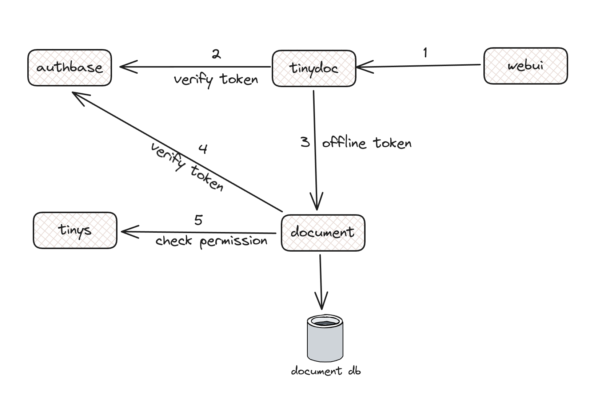

# User

User visits the website and logs in with their username and password. 
The user is then authenticated and a token is returned. 
The user can then use this token to access the website.

When the user request to create a document, the user is required to provide the document name and the content of the document.
The document service verifies the token validity and org permission before creating the document.

Now image the above services places at the backend of a website application called tinydoc.
This time we create a offline token for user with org write permission.
This token is used to communicate with the backend services like document, comment, blober service.

When the end user logs in, the user is authenticated and a token is returned for the tinydoc user.

When the user tries to create a document the user sends the token to the application backend.
Document service checks token validity and application specific permission. 
If the token is valid and the user has write permission, the request is forwarded to the document service.

The document service creates the document and returns the document id to the user.
